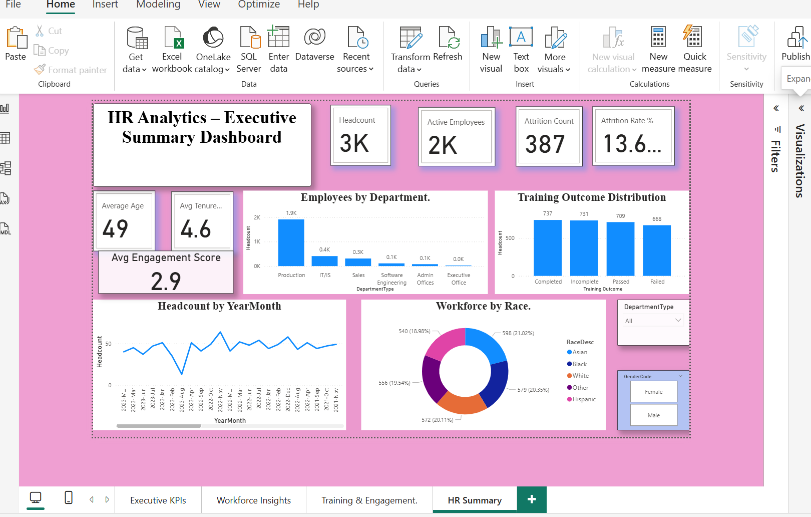
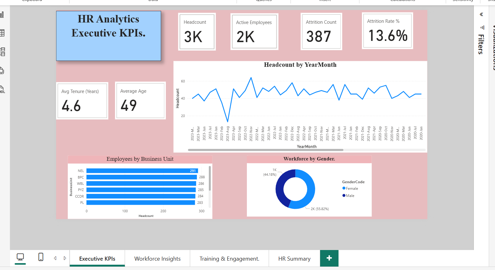
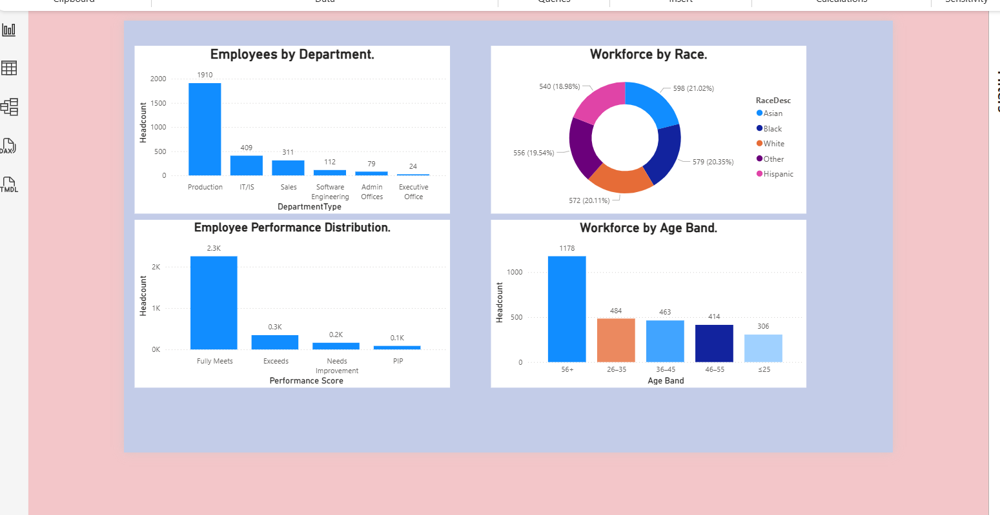

# 📊 Power BI HR Analytics Dashboard

An interactive HR Analytics Dashboard built in Power BI using an **HR dataset (3,000+ employees, 39 columns)**.  
This project analyzes workforce demographics, performance, training, and engagement metrics.

---

## 🔑 Key KPIs
- 👥 **Headcount**: 3K employees
- 🟢 **Active Employees**: 2K
- 🔴 **Attrition Count**: 387 (13.6% Attrition Rate)
- 📅 **Average Tenure**: 4.6 years
- 🎯 **Average Engagement Score**: 2.9
- 😊 **Average Satisfaction Score**: 3.0
- ⚖️ **Work-Life Balance Score**: 2.9
- 💰 **Total Training Cost**: $1.59M
- 📘 **Average Training Duration**: 3 days

---

## 📌 Insights
- 📉 Attrition Rate: **13.6%** – indicates potential retention challenges.  
- 🏭 **Production Department** has the highest headcount.  
- 🧑‍🤝‍🧑 Workforce diversity spread across multiple races.  
- 🎓 Training outcomes: Majority are **Completed/Passed**, with significant training investments.  

---

## 🛠 Tools Used
- **Power BI** – Data modeling, DAX measures, and visualization  
- **Power Query** – Data cleaning & transformation  
- **DAX** – Custom measures (Attrition Rate, Avg Tenure, Training KPIs)  

---

## 📂 Project Structure
- `HR_Analytics.pbix` → Power BI Dashboard file  
- `Screenshots/` → Dashboard images  
- `README.md` → Project description

## Preview

## 🔗 Connect with Me
- 💼 [LinkedIn](https://www.linkedin.com/in/your-profile)  
- 🖥 [GitHub Portfolio](https://github.com/rushendra248)
